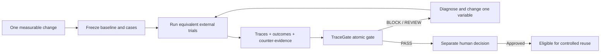
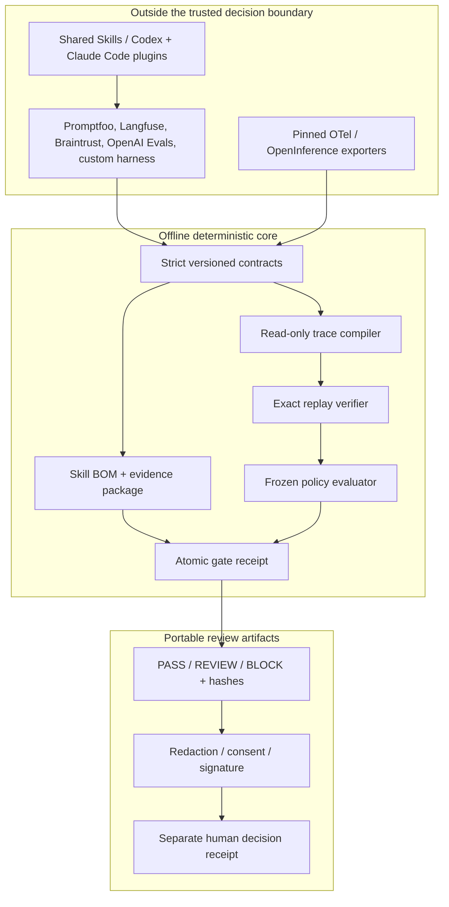

# AWE TraceGate

[](https://github.com/kingggg5/awe-tracegate/actions/workflows/ci.yml)
[](https://github.com/kingggg5/awe-tracegate/actions/workflows/codeql.yml)
[](LICENSE)
[](https://www.python.org/)

**Build better agents through experiments you can actually verify.**

AWE stands for **Agent Workflow Experimentation**:

```text
Discover → Experiment → Evaluate → Verify → Improve
                                  ↑
                              TraceGate
```

AWE TraceGate is a portable Agent Skills plugin for Codex and Claude Code, plus
a deterministic change gate.
Use your existing agent or evaluation harness to run trials; TraceGate binds the
exact Skill tree, traces, frozen evaluation, policy, repository revision, and
human decision into content-addressed artifacts that another reviewer can replay.

> **Pre-alpha.** TraceGate does not run agents, execute artifact content, deploy
> changes, or certify that a candidate is universally safe. `PASS` means the
> supplied and linked evidence satisfied the declared gate policy.

## What developers get

| Need | TraceGate provides |
| --- | --- |
| Compare an agent change | A falsifiable baseline/candidate Discovery Loop |
| Protect a pull request | One atomic `PASS`, `REVIEW`, or `BLOCK` receipt |
| Review an Agent Skill | A deterministic Skill BOM for the exact file tree |
| Connect an eval harness | Strict evidence envelopes and conformance checks |
| Share results | Consent-aware redaction, signing, and a local disclosure workflow |

The trusted path is offline, keyless, model-independent, and fail-closed. Skills
or chat output may orchestrate it, but they can never issue or override a gate
decision.

## Install the Skills

### npm from GitHub

The npm package is zero-dependency and has no lifecycle scripts. Until the first
npm registry release is published, install directly from the public Git repo:

```bash
npm exec --yes --package=github:kingggg5/awe-tracegate -- \
  awe-tracegate install --target .
```

Verify the managed file hashes later with:

```bash
npx awe-tracegate check --target .
```

The second command works after adding the package to the project or after the
registry release. The installer refuses unmanaged or locally modified Skill
directories; `--dry-run` previews a change without writing files.

### Git and Python

```bash
git clone https://github.com/kingggg5/awe-tracegate.git
python awe-tracegate/scripts/install_skills.py --target ./your-project
python awe-tracegate/scripts/install_skills.py --target ./your-project --check
```

### Codex Git marketplace

```bash
codex plugin marketplace add kingggg5/awe-tracegate --ref main
```

Restart the desktop app, open Plugins, choose **AWE TraceGate**, and install it.
For protected environments, replace `main` with a reviewed immutable release tag.

### Claude Code marketplace

Run these inside Claude Code:

```text
/plugin marketplace add kingggg5/awe-tracegate
/plugin install awe-tracegate@awe-tracegate
```

[Claude Code](https://code.claude.com/docs/en/plugins) namespaces plugin Skills.
Invoke the evidence gate explicitly, for example:

```text
/awe-tracegate:tracegate-verify-evidence verify the evidence in ./evidence.
```

The four evidence-changing workflows are user-invoked only in Claude Code. The
read-only readiness check may be selected automatically. No Skill grants tools,
installs the Python engine, or weakens Claude Code permission prompts.

The npm and Python installers copy only versioned Skill files into
`.agents/skills/`; the Claude marketplace uses its generated, namespaced adapter.
They do
not install Python, fetch model dependencies, read credentials, start a service,
or execute project code.

## Included Skills

| Skill | Use it when |
| --- | --- |
| [`$tracegate-check`](skills/tracegate-check/SKILL.md) | Checking local CLI and evidence readiness |
| [`$tracegate-compare-change`](skills/tracegate-compare-change/SKILL.md) | Comparing one prompt, Skill, model, or workflow change |
| [`$tracegate-verify-evidence`](skills/tracegate-verify-evidence/SKILL.md) | Running the atomic gate over existing local artifacts |
| [`$tracegate-integrate-evidence`](skills/tracegate-integrate-evidence/SKILL.md) | Mapping an eval or telemetry export into strict evidence |
| [`$tracegate-share-evidence`](skills/tracegate-share-evidence/SKILL.md) | Preparing a redacted, consented bundle for review |

Evidence-touching Skills require explicit invocation. For example:

```text
$tracegate-compare-change compare the candidate retry Skill with the baseline.
Freeze the cases and success rule, preserve failed trials, and stop before promotion.
```

## Install the evidence engine

Requires Python 3.11 or newer:

```bash
git clone https://github.com/kingggg5/awe-tracegate.git
cd awe-tracegate
python -m venv .venv
python -m pip install -e ".[api]"
awe --version
awe capabilities --json
```

## Create an atomic gate receipt

Optionally inventory the exact source Skill first:

```bash
awe skill inspect \
  --path skills/tracegate-compare-change \
  --out skill-bom.json
```

Then compile, replay, link, and evaluate the complete chain with one command:

```bash
awe gate \
  --traces examples/repo_analysis/traces.jsonl \
  --baseline examples/evaluation/baseline.json \
  --candidate examples/evaluation/candidate.json \
  --policy examples/evaluation/policy.json \
  --skill-bom skill-bom.json \
  --out gate.json
```

| Decision | Exit | Meaning |
| --- | ---: | --- |
| `PASS` | `0` | Exact replay and the linked frozen evaluation passed |
| `REVIEW` | `2` | Evidence is valid but uncertainty or efficiency regression needs review |
| `BLOCK` | `2` | Integrity, linkage, safety, quality, or policy failed |
| `ERROR` | `1` | Input or invocation was malformed |

No evaluation, mismatched candidate digest, or replay without source traces can
produce `PASS`.

## Discovery Loop



The loop proposes and measures changes; it never promotes itself. Failed,
refused, timed-out, and missing trials remain visible.

## Architecture and trust boundary



Trace, log, prompt, and Skill content is always untrusted data. TraceGate never
executes embedded commands, follows embedded URLs, dynamically loads adapters,
or treats model confidence as evidence.

## Evidence interoperability

Adapters run outside the verifier and emit `awe.evidence-envelope.v1`. Validate
an envelope without executing it:

```bash
awe conformance --envelope adapter-envelope.json --out conformance.json
```

The current engine includes provider-neutral evaluation JSON and a revision-
pinned OpenTelemetry GenAI importer. Promptfoo, Langfuse, Braintrust, OpenAI
Evals, and other systems should integrate through the same envelope rather than
adding their SDKs or credentials to the trusted core.

Evidence packages can additionally bind repository URI, exact commit, producer
and environment digests, capture time, maximum age, provenance level, and the
external verification artifact supporting a signed or attested claim.
Version 0.3 enforces only an `asserted` minimum provenance level. Signed and
attested labels remain recorded metadata until a future trusted verifier can
replay the external verification artifact; they cannot satisfy a gate floor.

## GitHub Action

For a quick evaluation, use the current GitHub Marketplace release:

```yaml
- name: AWE TraceGate
  id: tracegate
  uses: kingggg5/awe-tracegate@3
  with:
    traces: evidence/traces.jsonl
    baseline-evaluation: evidence/baseline.json
    candidate-evaluation: evidence/candidate.json
    evaluation-policy: evidence/policy.json
```

Release tag `3` currently resolves to commit
`e94b4ee1d858c26ccc2ba04cecdb6628f44aa2e6`. Tags can be moved or deleted, so
protected repositories should pin that full reviewed SHA:

```yaml
name: TraceGate
on: [pull_request]

permissions:
  contents: read

jobs:
  gate:
    runs-on: ubuntu-latest
    steps:
      - uses: actions/checkout@de0fac2e4500dabe0009e67214ff5f5447ce83dd
      - id: tracegate
        uses: kingggg5/awe-tracegate@e94b4ee1d858c26ccc2ba04cecdb6628f44aa2e6
        with:
          traces: evidence/traces.jsonl
          baseline-evaluation: evidence/baseline.json
          candidate-evaluation: evidence/candidate.json
          evaluation-policy: evidence/policy.json
          skill-bom: evidence/skill-bom.json
      - run: test "${{ steps.tracegate.outputs.decision }}" = "PASS"
```

The Action publishes one `awe.gate-receipt.v1` output. It cannot report `PASS`
from compilation integrity alone or from an evaluation belonging to another
candidate.

## Optional local review UI

Run `awe serve`, then open [http://127.0.0.1:8765](http://127.0.0.1:8765).
TraceGate Review loads local JSON/JSONL evidence and uses the same typed engine.
It is a review surface—not an AI chat, agent runtime, identity provider, or
production control plane.


## Project status

The current GitHub Marketplace release is tag `3`, built from the merged v0.3
source at `e94b4ee1d858c26ccc2ba04cecdb6628f44aa2e6`. A future release should restore
SemVer naming (`v0.3.0` or later) while keeping tag `3` available for existing
workflows.

Implemented:

- atomic exact-evidence gate and Skill BOM;
- evidence package, provenance/freshness checks, and adapter conformance;
- five portable Skills with 25 routing/effect eval cases;
- safe zero-dependency npm and Python installers plus Codex and Claude Code
  marketplace metadata;
- deterministic compiler, evaluator, redaction, signing, Action, API, generated
  TypeScript client, and optional local UI.

Still required before a production-ready claim:

- publish and smoke-test immutable npm/Python/plugin releases;
- complete an independent external-adopter pilot;
- add authenticated actors and an append-only decision ledger before exposing a
  shared network service.

Autonomous execution, browser control, deployment, model routing, memory, hidden
telemetry, and automatic promotion are intentionally out of scope.

## Community

- [Contributing](CONTRIBUTING.md)
- [Security policy](SECURITY.md) and [threat model](docs/security.md)
- [Architecture](docs/architecture.md)
- [Related work](docs/related-work.md)
- [Roadmap](docs/roadmap.md)
- [Changelog](CHANGELOG.md)
- [Request an external pilot](https://github.com/kingggg5/awe-tracegate/issues/new?template=pilot_request.yml)

The most valuable contributions are independent adapters, adversarial fixtures,
reproducible public pilots, and cross-host Skill compatibility results.

## License

Apache-2.0. See [LICENSE](LICENSE).
