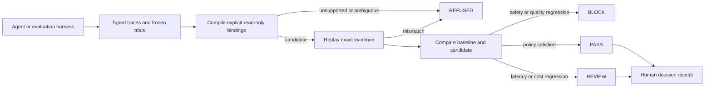
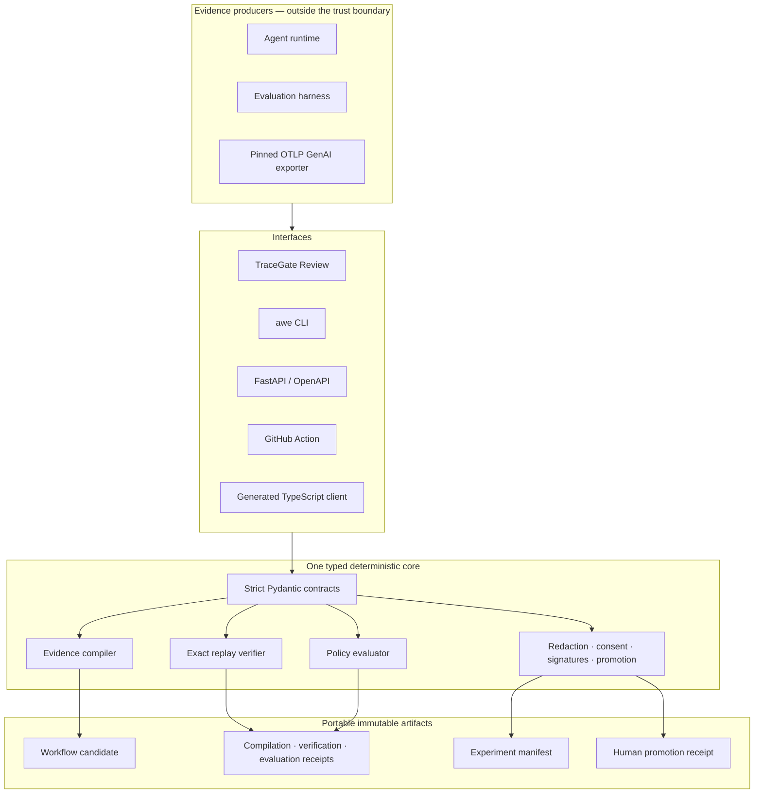

# AWE TraceGate

[](https://github.com/kingggg5/awe-tracegate/actions/workflows/ci.yml)
[](https://github.com/kingggg5/awe-tracegate/actions/workflows/codeql.yml)
[](LICENSE)
[](https://www.python.org/)

**Prove when repeated agent behavior is reliable enough to review for reuse.**

TraceGate turns typed execution traces into a content-addressed workflow
candidate, replays the exact evidence, compares frozen evaluations, and records
a human decision. The verifier is deterministic, offline, and requires no LLM
credential.

> **Pre-alpha.** TraceGate does not run agents, execute tools, install skills,
> deploy changes, or authorize production actions.


The screenshot uses the included synthetic sample. TraceGate Review also accepts
local JSONL/JSON evidence and calls the real API pipeline.

## Why it exists

Agent traces can look repeatable while hiding model decisions, ambiguous data
flow, stale evaluations, or unsafe effects. TraceGate refuses to infer around
those gaps.

- **Fail closed:** write-like effects, mixed workflow shapes, model-authored
  bindings, missing evidence, and digest mismatches are refused.
- **Replay exact evidence:** candidate, input bundle, receipt, and source trace
  digests are recomputed on every verification.
- **Compare outcomes:** safety and quality regressions block; latency or cost
  regressions require review.
- **Keep provenance:** experiment manifests bind repository, commit, dataset
  split, harness, strategy, model configuration, grader, tokens, cost, latency,
  and source traces.
- **Govern reuse:** redaction, consent, signatures, and a replay-gated human
  promotion receipt are first-class artifacts.

`PASS` means the supplied evidence satisfied the configured policy. It does not
mean the candidate is universally safe or approved to execute.

## Try it locally

Requires Python 3.11 or newer.

```bash
git clone https://github.com/kingggg5/awe-tracegate.git
cd awe-tracegate
python -m venv .venv
python -m pip install -e ".[api]"
awe serve
```

Open [http://127.0.0.1:8765](http://127.0.0.1:8765) to use **TraceGate Review**.
Explicit buttons and forms load evidence, run the deterministic gate, inspect
artifacts, and record a decision; this surface is not an AI chat or goal
composer. Human approval is never preselected. The reviewer identifier is
recorded as an assertion in the receipt and is not authenticated by the local
app.

For the CLI-only path:

```bash
awe compile \
  --traces examples/repo_analysis/traces.jsonl \
  --out compilation.json

awe verify \
  --receipt compilation.json \
  --traces examples/repo_analysis/traces.jsonl \
  --out verification.json
```

Exit code `0` means the requested gate passed, `2` means a valid refusal,
review, block, or invalid receipt, and `1` means malformed input or an execution
error.

## How the evidence loop works



The harness may use any model or runtime. TraceGate consumes exported evidence
only; model calls and provider credentials remain outside the trusted core.

## Architecture



Python/Pydantic remains the reference decision engine. The TypeScript package is
a generated integration client, not a second implementation. A C#/.NET or Rust
rewrite must first demonstrate byte-identical golden receipts plus measured
cold-start, peak-RSS, binary-size, and throughput gains.

## GitHub Action

The latest released Action is `v0.2.0`. Pin a reviewed commit SHA in protected
repositories.

```yaml
name: AWE TraceGate
on: [pull_request]

permissions:
  contents: read

jobs:
  tracegate:
    runs-on: ubuntu-latest
    steps:
      - uses: actions/checkout@3d3c42e5aac5ba805825da76410c181273ba90b1
      - id: gate
        uses: kingggg5/awe-tracegate@v0.2.0
        with:
          traces: evidence/traces.jsonl
          baseline-evaluation: evidence/baseline.json
          candidate-evaluation: evidence/candidate.json
          evaluation-policy: evidence/policy.json
      - uses: actions/upload-artifact@b7c566a772e6b6bfb58ed0dc250532a479d7789f
        with:
          name: awe-receipts
          path: |
            awe-compilation-receipt.json
            awe-verification-receipt.json
```

Generating agent trials may still require the credentials of your existing
harness. The TraceGate verifier itself does not.

## Real repository pilot

The first maintainer-run compatibility pilot uses
[`pallets/itsdangerous`](https://github.com/pallets/itsdangerous) at exact commit
`672971d66a2ef9f85151e53283113f33d642dabd`.

- The upstream suite passed: **297 tests**.
- A clean Windows/Python 3.12 install from the local checkout reached an exact
  replay result in **14.51 seconds**.
- TraceGate compiled and replayed two read-only repository-analysis traces:
  `status=valid`, `traces_verified=true`.
- Only file paths, sizes, and SHA-256 digests are retained; no upstream source
  content is redistributed.

See the [pilot manifest](examples/external_pilot/itsdangerous/pilot.json),
[source traces](examples/external_pilot/itsdangerous/traces.jsonl), and
[verification receipt](examples/external_pilot/itsdangerous/verification.json).
This is compatibility evidence, not an external-adopter or production-safety
claim.

## Discovery loop direction

TraceGate already implements the governance half of a discovery loop:

```text
external runtime explores → exports traces and frozen trials
TraceGate compiles → replays → evaluates → records human review
approved candidate returns to an operator-controlled registry or runtime
```

**AWE Workspace** is a separate companion application and process boundary. It
owns the goal/command composer, task sessions, tools, and future agent runtimes;
it is not installed by this package and does not run inside TraceGate. Workspace
output can enter the gate only as typed evidence; prompt text and agent prose
cannot override a TraceGate decision.

This is intentionally different from building another general agent desktop
inside the verifier. Existing systems already own agent execution; TraceGate's
useful distinction is the promotion receipt between discovery and reuse.

## Interfaces

| Surface | Purpose |
| --- | --- |
| TraceGate Review | Explicit local evidence controls over the real API chain |
| `awe` CLI | Compile, verify, evaluate, import, redact, sign, and promote |
| FastAPI / OpenAPI | Typed private integration surface |
| GitHub Action | Branch-protection-ready deterministic gate |
| TypeScript client | Generated API integration with drift checks |
| Generic and OTLP importers | Normalize external experiment evidence |

Run `awe --help` for all commands. Export versioned schemas with:

```bash
awe schema --out-dir schemas
```

## Project status

**Implemented now**

- deterministic compilation and exact replay;
- frozen baseline/candidate evaluation;
- generic and pinned OTLP experiment import;
- governed redaction and consent checks;
- optional Ed25519 bundles;
- replay-gated human decisions with a neutral default;
- local TraceGate Review, Action, API, and TypeScript client.

**Before calling v0.3 production-ready**

- one independent external adopter and a repeatable under-10-minute onboarding;
- reviewed immutable v0.3 tag and Action smoke test from that tag;
- authenticated actors and an append-only receipt ledger;
- a production deployment profile with tenancy and rate limiting.

Signed `.exe` and `.dmg` installers are not shipped yet. The current priority is
a reliable CLI/web workflow. A Tauri 2 desktop shell is justified only after
usage proves that native file integration outweighs sidecar, code-signing,
notarization, updater-key, and multi-platform release complexity.

## Community

- [Request an external pilot](https://github.com/kingggg5/awe-tracegate/issues/new?template=pilot_request.yml)
- [Report a bug](https://github.com/kingggg5/awe-tracegate/issues/new?template=bug_report.yml)
- [Propose a feature](https://github.com/kingggg5/awe-tracegate/issues/new?template=feature_request.yml)
- Read [Contributing](CONTRIBUTING.md), [Security](SECURITY.md), and the
  [technical threat model](docs/security.md).

The best contributions are new evidence adapters, adversarial fixtures, and
reproducible public pilots—not additional autonomous execution paths.

## Documentation

- [Architecture](docs/architecture.md)
- [Security model](docs/security.md)
- [Related work and differentiation](docs/related-work.md)
- [Roadmap](docs/roadmap.md)
- [Changelog](CHANGELOG.md)

## License

Apache-2.0. See [LICENSE](LICENSE).
