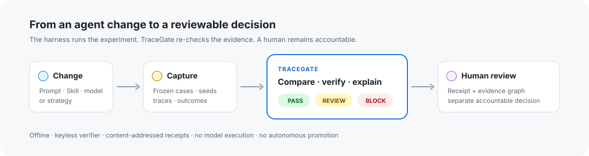
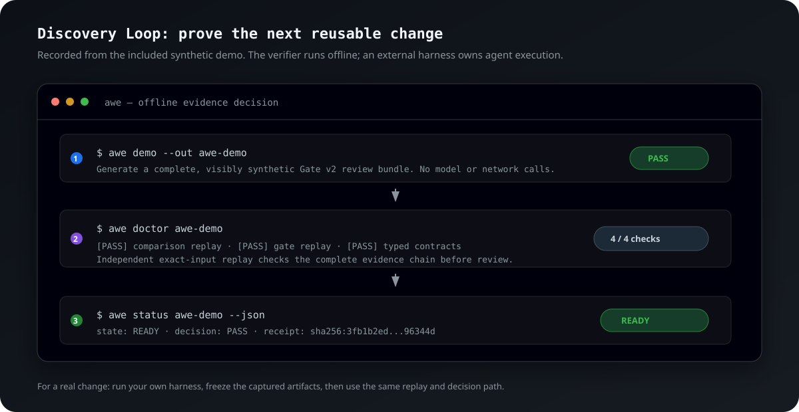
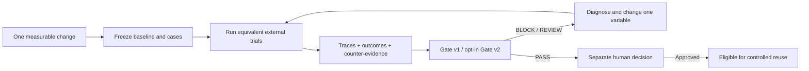
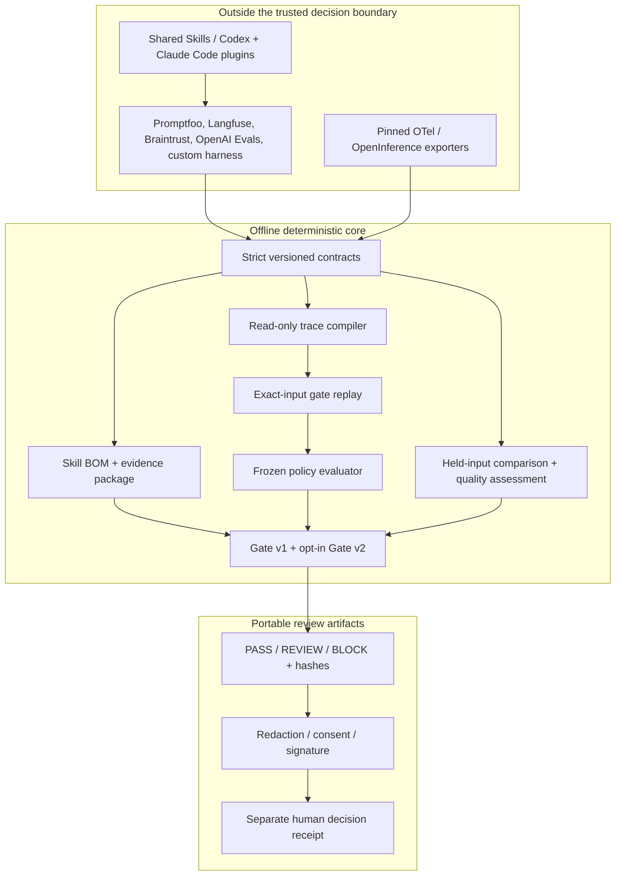
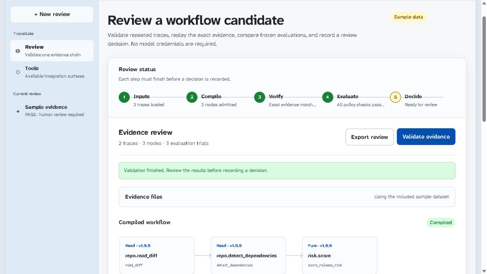

# AWE TraceGate

[](https://github.com/kingggg5/awe-tracegate/actions/workflows/ci.yml)
[](https://github.com/kingggg5/awe-tracegate/actions/workflows/codeql.yml)
[](LICENSE)
[](https://www.python.org/)
[](https://github.com/marketplace/actions/awe-tracegate)

**Reproducible evidence infrastructure for agent experiments.**

[Quickstart](#start-here) · [Decision recipes](#pick-a-decision-not-a-feature) ·
[GitHub Action](#github-action) · [Skills](#install-the-skills) ·
[Architecture](docs/architecture.md) · [Roadmap](docs/roadmap.md)

> Don't merely observe an agent. Determine whether the supplied evidence
> supports the change.



### See the discovery loop run



The walkthrough is rendered from the included synthetic CLI fixture. It shows
the real `demo` -> `doctor` -> `status` contract, not an LLM session or a
fabricated customer result. When SVG animation is disabled by a renderer, every
step remains readable as a static image.

AWE stands for **Agent Workflow Experimentation**:

```text
Discover → Experiment → Evaluate → Verify → Improve
                                  ↑
                              TraceGate
```

The trusted TraceGate core does not build or run your agent. It focuses on a
narrower engineering question: **did this controlled agent, strategy, or model
change improve the result—and is the supplied evidence strong enough to act
on?** The same repository also includes AWE Workspace, a separate local process
for human-approved handoffs to external agent hosts.

**TraceGate is AWE's trusted evidence-integrity and decision core.** It is a
portable Agent Skills plugin for Codex and Claude Code plus an offline
deterministic gate. Your existing agent or evaluation harness runs the trials.
TraceGate binds the exact Skill tree, captured traces, frozen baseline and
candidate outcomes, and policy into a content-addressed gate receipt. An
optional evidence package adds repository/provenance metadata, and a human
decision is recorded separately.

```text
Agent change
    ↓
External harness records trials
    ↓
Captured traces + frozen baseline/candidate outcomes
    ↓
TraceGate: validate linkage → re-run deterministic gate → apply policy
    ↓
PASS / REVIEW / BLOCK
    ↓
Separate human decision
```

`ExperimentManifest` preserves model, harness, grader, environment, and seed
identity for interoperability. Gate v1 intentionally remains unchanged. The
opt-in Gate v2 path replays a supplied `ComparisonReceipt` from held manifests
and can require typed terminal outcomes plus asserted judge-calibration evidence.

> **Pre-alpha.** TraceGate does not reconstruct external model or tool calls,
> execute artifact content, deploy changes, establish causality, or certify that
> a candidate is universally safe. `PASS` means only that the supplied and
> linked evidence satisfied the declared gate policy.

## What developers get

| Need | TraceGate provides |
| --- | --- |
| Compare an agent change | Frozen baseline/candidate outcomes under explicit policy thresholds |
| Protect a pull request | One atomic `PASS`, `REVIEW`, or `BLOCK` receipt |
| Review an Agent Skill | A deterministic Skill BOM for the exact file tree |
| Connect an eval harness | Strict evidence envelopes and conformance checks |
| Share results | Consent-aware redaction, signing, and a local disclosure workflow |
| Work across agent hosts | The same focused Skills for Codex, Claude Code, npm, or Git installs |
| Coordinate agent work locally | AWE Workspace saves goals and exports explicitly approved, narrowly permissioned handoffs |
| Learn from real coding-agent runs | A consented external adapter normalizes Codex, Claude Code, or generic JSONL into redacted trace receipts and PostgreSQL/Alembic evidence bundles |
| Avoid another model credential | The verifier is offline and needs no LLM-provider key |
| Re-check a decision later | Re-run Gate v1 or comparison verification from separately held inputs and compare receipt hashes |
| Operate the workflow after setup | `awe status` summarizes scaffold integrity, missing real inputs, bundle replay, decision, and next action |
| Make a richer promotion decision | Gate v2 composes the v1 gate, held-input comparison replay, and typed quality evidence |
| Investigate a decision | `awe explain` emits a deterministic evidence graph and explicit limitations |

The trusted path is offline, keyless, model-independent, and fail-closed. Skills
or chat output may orchestrate it, but they can never issue or override a gate
decision.

In the current release, **exact-input replay** means re-running the deterministic
gate from the original JSON/JSONL inputs and requiring the same canonical
receipt. It does not replay a live model backend, reproduce network responses,
or claim that a stochastic agent run can be reconstructed bit-for-bit.

## Agent runtime workspace

The monorepo includes [`apps/workspace`](apps/workspace), a dependency-light
TypeScript app for coordinating agent work without moving execution authority
into TraceGate. It supports this local flow:

```text
Save goal -> Define discovery brief -> Select external runner and permissions
          -> Human approval + optional trace consent -> Export typed handoff
          -> External agent + isolated harness -> Discovery adapter
          -> Validate resulting held evidence with TraceGate
```

Workspace currently supports Codex, Claude Code, or another external runner and
only three grants: read the selected goal, read stored evidence references, and
write a local checkpoint. Trace capture and PostgreSQL/Alembic evaluation are
separate, optional consent scopes and are off by default. Consent can be revoked
locally, but already exported copies require separate handling. Workspace does
not invoke the runner, execute a shell or browser, install connectors, hold
provider credentials, or convert a checkpoint into evidence. This keeps the
Python decision core offline, keyless, and fail-closed.

```bash
npm run workspace:install
npm run workspace:test
npm run workspace:start
```

Then open <http://127.0.0.1:8787>. See the
[Workspace package README](apps/workspace/README.md) for its API, schemas, and
security boundary.

## PostgreSQL/Alembic agent reliability

The first implemented external Discovery adapter deliberately targets one
domain: coding-agent changes to PostgreSQL/Alembic migrations. It connects the
three AWE boundaries without turning TraceGate into an agent runtime:

```text
Workspace: goal -> permissions -> human approval -> optional trace consent
External host: Codex / Claude Code / other runner -> raw JSONL trace
Isolated harness: forward -> rollback -> data preservation -> tests
Discovery adapter: redact -> bind exact repo/SHA -> group typed failures
TraceGate: compare -> exact held-input replay -> Gate v2 -> explain
```

`awe-discovery ingest-trace` accepts Codex `exec --json`, Claude Code
`--output-format stream-json`, or the documented generic JSONL shape. It keeps
event types, allowlisted operation names, typed outcomes, usage counters, and
payload digests; it does not retain raw prompts, commands, or outputs. The
repository/SHA binding is explicitly caller-asserted until a trusted runner
attestation is supplied. Payload digests prove integrity, not anonymity, so
capture-side secret/PII controls are still required.

`awe-discovery build-migration-bundle` requires separate
`evaluate_migration` consent and exactly four sorted evidence lanes for every
frozen case: forward migration, rollback, data preservation, and tests. A
successful `alembic upgrade head` cannot hide missing rollback evidence or data
loss. The adapter emits an `ExperimentManifest`, typed quality evidence, a
deterministic failure-cluster report, and one content-addressed bundle ready for
the existing comparison flow.

```bash
awe-discovery ingest-trace --help
awe-discovery build-migration-bundle --help
```

Run the complete checked-in example in
[`examples/postgres-alembic-discovery`](examples/postgres-alembic-discovery).
The fixture is synthetic; an independent real-world pilot remains a release
criterion.

## Start here

Choose the smallest path that matches the decision you need to make. The
verifier itself requires no model-provider credential in every path.

| If you need to… | Start with | What you get |
| --- | --- | --- |
| Gate existing trace and evaluation artifacts in CI | The published [GitHub Action](#github-action) (`@3`, or a reviewed SHA) | A stable `awe.gate-receipt.v1` and one `PASS` / `REVIEW` / `BLOCK` decision |
| Compare a controlled agent, strategy, prompt, commit, or model change | The v0.3 source install and [`awe compare`](#compare-controlled-experiments) | A held-input comparison receipt, followed by optional Gate v2 review |
| Add a repeatable review workflow to Codex or Claude Code | [Install the Skills](#install-the-skills) | Focused host instructions that orchestrate the same local verifier |

For a complete local tour, clone the repository and run the self-contained
synthetic demo:

```bash
git clone https://github.com/kingggg5/awe-tracegate.git
cd awe-tracegate
python -m pip install -e ".[api]"
awe demo --out awe-demo
awe doctor awe-demo
```

If you already know the decision you need, let the machine-readable recipe
catalog choose the smallest valid evidence path and create a policy-only
workspace:

```bash
awe recipes
awe recipes --show promotion_review
awe init --recipe promotion_review --out awe-evidence
awe status awe-evidence
```

`awe init` writes only guidance, explicit policy defaults, their raw-file
digests, and `awe.recipe-scaffold-manifest.v1`. It never fabricates traces,
experiment results, consent, signatures, receipts, or a human verdict. Existing
output directories are refused instead of overwritten. Use `--dry-run --json`
to inspect the exact managed files without writing.

`awe status` is the read-only day-two view. A policy-only recipe remains
`ACTION_REQUIRED`; file presence is never upgraded into verified evidence. A
canonical Gate v2 directory becomes `READY` only when the same held-input
checks used by `awe doctor` reproduce. Modified recipe definitions, digests, or
path redirection attempts are `INVALID`.

`awe demo` generates and runs the complete synthetic Gate v2 path. `awe doctor`
independently reloads its held inputs and re-checks the comparison, Gate v2
receipt, typed quality evidence, and explanation graph. It exits `0` only when
the bundle is internally reproducible; missing or mismatched evidence exits `2`
with a versioned `awe.review-bundle-report.v1` when `--json` is used.

```text
AWE TraceGate synthetic demo
  Gate v2             PASS
  Comparison          pass
  Comparison replay   valid
  Quality             baseline=pass candidate=pass
  Receipt              sha256:3fb1b2ed...96344d
  Evidence graph       sha256:a418df8b...f7277d
  Scope                 synthetic, offline, no model or network calls

AWE review bundle: READY
  [PASS] comparison_replay
  [PASS] explanation_replay
  [PASS] gate_replay
  [PASS] typed_contracts
```

The demo is a contract/reproducibility check, not an agent benchmark. Replace
its synthetic files with separately captured harness evidence before making a
real change decision. See the [decision recipes](docs/decision-recipes.md) for
the smallest valid evidence chain for each use case. The v0.3 doctor profile
covers the package-free standard layout; Gate v2 receipts that bind a Skill BOM
or provenance package must still be replayed with their explicit protected
expectations.

For the complete v2 chain, use the checked-in
[canonical synthetic fixture](examples/canonical-agent-change/README.md). It
replays a compiled candidate, frozen paired experiment, terminal outcomes,
asserted judge/human labels, comparison verification, Gate v2, and its evidence
graph. It is intentionally **not** presented as a real benchmark or an
independent external-adopter pilot.

## Start a discovery loop from your existing AI host

You can ask Codex, Claude Code, or another compatible host to help structure a
discovery cycle. The host can use its configured tools and permissions to do
the task; TraceGate gives the resulting change a reproducible decision path.
This keeps AWE useful across coding, research, support, browser, and workflow
agents without pretending that the verifier is another autonomous runtime.

| Discovery mode | Ask the host | What AWE keeps honest |
| --- | --- | --- |
| Capability | “Compare this new code-review Skill against the frozen baseline.” | Case/seed pairing, declared treatment, success and safety outcomes |
| Reliability | “Find why this workflow sometimes fails; preserve every timeout and refusal.” | Typed terminal outcomes, missing trials, counter-evidence, and replay |
| Efficiency | “Test whether the new strategy reduces cost or p95 latency without hurting quality.” | Exact efficiency thresholds and a `REVIEW` instead of a false pass |
| Safety | “Evaluate the safer prompt against the same adversarial cases.” | Frozen policy, safety sidecars, calibration claims, and fail-closed linkage |
| Integration | “Map this OTLP or harness export into an evidence plan; do not invent fields.” | Strict adapter envelopes and explicit unknown fields |
| Governance | “Prepare this evidence for review, redact it, and stop before publishing.” | Consent, redaction, signatures, and a separate human decision |

Use the focused Skills as the command surface. For example:

```text
$tracegate-compare-change turn “make the incident-triage agent more reliable”
into one measurable candidate. Freeze the cases, keep failures and timeouts,
and stop before promotion.
```

The response can plan or explain the next experiment, but it cannot become
evidence by itself. A `PASS` still requires independently captured artifacts,
the deterministic gate, and a separate human decision before reuse.

## Install the Skills

### npm from GitHub

The npm package is zero-dependency and has no lifecycle scripts. Until the first
npm registry release is published, install directly from the public Git repo:

```bash
npm exec --yes --package=github:kingggg5/awe-tracegate -- \
  awe-tracegate install --target .
```

Confirm the package version before installing into a protected repository:

```bash
npm exec --yes --package=github:kingggg5/awe-tracegate -- \
  awe-tracegate --version
```

Verify the managed file hashes later with:

```bash
npx awe-tracegate check --target .
```

The second command works after adding the package to the project or after the
registry release. The installer refuses unmanaged or locally modified Skill
directories; `--dry-run` previews a change without writing files.

### Git and Python

```bash
git clone https://github.com/kingggg5/awe-tracegate.git
python awe-tracegate/scripts/install_skills.py --target ./your-project
python awe-tracegate/scripts/install_skills.py --target ./your-project --check
```

### Codex Git marketplace

```bash
codex plugin marketplace add kingggg5/awe-tracegate --ref main
```

Restart the desktop app, open Plugins, choose **AWE TraceGate**, and install it.
For protected environments, replace `main` with a reviewed immutable release tag.

### Claude Code marketplace

Run these inside Claude Code:

```text
/plugin marketplace add kingggg5/awe-tracegate
/plugin install awe-tracegate@awe-tracegate
```

[Claude Code](https://code.claude.com/docs/en/plugins) namespaces plugin Skills.
Invoke the evidence gate explicitly, for example:

```text
/awe-tracegate:tracegate-verify-evidence verify the evidence in ./evidence.
```

The four evidence-changing workflows are user-invoked only in Claude Code. The
read-only readiness check may be selected automatically. No Skill grants tools,
installs the Python engine, or weakens Claude Code permission prompts.

The npm and Python installers copy only versioned Skill files into
`.agents/skills/`; the Claude marketplace uses its generated, namespaced adapter.
They do
not install Python, fetch model dependencies, read credentials, start a service,
or execute project code.

## Included Skills

| Skill | Use it when |
| --- | --- |
| [`$tracegate-check`](skills/tracegate-check/SKILL.md) | Checking local CLI and evidence readiness |
| [`$tracegate-compare-change`](skills/tracegate-compare-change/SKILL.md) | Comparing one prompt, Skill, model, or workflow change |
| [`$tracegate-verify-evidence`](skills/tracegate-verify-evidence/SKILL.md) | Running the atomic gate over existing local artifacts |
| [`$tracegate-integrate-evidence`](skills/tracegate-integrate-evidence/SKILL.md) | Mapping an eval or telemetry export into strict evidence |
| [`$tracegate-share-evidence`](skills/tracegate-share-evidence/SKILL.md) | Preparing a redacted, consented bundle for review |

Evidence-touching Skills require explicit invocation. For example:

```text
$tracegate-compare-change compare the candidate retry Skill with the baseline.
Freeze the cases and success rule, preserve failed trials, and stop before promotion.
```

## Why use the plugin instead of another prompt

A prompt can suggest a good review process, but it cannot prove which files,
traces, cases, policy, or candidate were evaluated. The plugin gives Codex and
Claude Code a shared operational contract around the deterministic engine:

- **Portable workflow:** install the same Skill set per repository without
  copying long instructions into every conversation.
- **Focused context:** compatible hosts can load the matching Skill on demand,
  avoiding the need to paste the full TraceGate manual into every task.
- **Host-independent evidence:** Codex and Claude Code can explain results in
  different words while producing and citing the same gate contract.
- **Safer defaults:** evidence-changing workflows are explicit-only, artifact
  content is treated as untrusted data, and missing links fail closed.
- **Framework interoperability:** adapt exports from an existing evaluation or
  telemetry harness rather than replacing the harness or running another agent.
- **Supply-chain visibility:** bind the exact Skill tree through a deterministic
  Skill BOM so a reviewer knows which instructions changed.
- **Reviewable sharing:** redact and package evidence locally before a human
  decides whether it may leave the repository.

The plugin does not make TraceGate an autonomous agent. It never runs trials,
chooses a winner, promotes a Skill, uploads evidence, or bypasses host approval.

## Where AWE focuses

Braintrust, LangSmith, Phoenix, and other established systems already provide
tracing, datasets, evaluations, experiment comparison, and CI workflows. AWE is
not trying to replace those systems or win on dashboard breadth. They can remain
the systems that produce and inspect trial data.

AWE focuses on the decision boundary after an agent change:

- **What exactly changed?** Bind the repository revision, Skill tree, dataset,
  traces, outcomes, policy, and producer metadata.
- **Can a reviewer re-check the supplied conclusion?** Re-run the offline gate
  from separately held evidence and consumer-owned expectations.
- **What does the evidence permit?** Emit one fail-closed `PASS`, `REVIEW`, or
  `BLOCK` receipt, followed by a separate human decision.
- **Does the frozen experiment support the conclusion?** The experimental
  `awe compare` command checks matched cases and seeds, declared treatment
  factors, sample sufficiency, flakiness, an exact sign test, and a bounded 95%
  normal-approximation interval. Gate v2 adds held-input comparison replay.
  Typed terminal outcomes, asserted judge calibration, and bounded environment /
  seed sensitivity are separate evidence contracts, never LLM-generated facts.

This makes TraceGate an evidence and reproducibility control point for agent
changes, not another observability backend or experiment runner.

## Practical workflows

| Goal | Example invocation | Result |
| --- | --- | --- |
| Check whether the project is ready | `$tracegate-check inspect this repository and list missing local prerequisites.` | Read-only capability and evidence readiness report. |
| Plan a prompt or Skill comparison | `$tracegate-compare-change compare candidate retry behavior with the frozen baseline; preserve every failed trial.` | Baseline/candidate plan with measurable rules and no silent trial deletion. |
| Gate existing eval artifacts | `$tracegate-verify-evidence gate ./evidence and cite the receipt digest.` | Atomic `PASS`, `REVIEW`, `BLOCK`, or `ERROR` receipt bound to the candidate. |
| Connect another harness | `$tracegate-integrate-evidence map this OTLP or eval export into a strict envelope; do not invent missing fields.` | Conformance report and explicit unknown/unsupported fields. |
| Share a review bundle | `$tracegate-share-evidence prepare a redacted local bundle for external review; do not upload it.` | Consent-aware disclosure manifest, redaction summary, and residual-risk warning. |

This separation lets teams keep their preferred agent and eval stack while using
one small, auditable gate at the point where a change becomes reusable.

### Pick a decision, not a feature

| Decision you need | Minimum path | Fail-closed condition |
| --- | --- | --- |
| Did a prompt or Skill change help on the frozen suite? | `compare` -> `verify-comparison` | Cases, seeds, controls, or subject identity do not match |
| May CI accept these existing artifacts? | `gate` | Compilation, replay, evaluation, policy, or candidate linkage is incomplete |
| Is the richer promotion bundle coherent? | `gate-v2` -> `doctor` | Comparison, quality evidence, or graph cannot be replayed from held inputs |
| Can another harness feed TraceGate? | `import-experiment` -> `conformance` | Required identity or outcome fields are missing |
| Can evidence leave the repository? | `redact` -> consent check -> optional `sign` | Scope, consent, redaction, or trusted-key expectations are incomplete |

[Decision recipes](docs/decision-recipes.md) include copy-ready inputs,
commands, outputs, and anti-claims for each path. The catalog is intentionally
small: AWE does not need a separate command for every agent host or eval vendor.
The same catalog is available to CLIs, Skills, and integration tooling through
`awe recipes --json` and the exported
`awe.decision-recipe-catalog.v1` JSON Schema.

## Install the evidence engine

Requires Python 3.11 or newer:

```bash
git clone https://github.com/kingggg5/awe-tracegate.git
cd awe-tracegate
python -m venv .venv
python -m pip install -e ".[api]"
awe --version
awe capabilities --json
```

## Compare controlled experiments

`awe compare` is an additive experimental path over two full
`ExperimentManifest` inputs. It preserves the model, strategy, repository,
harness, dataset split, environment, grader, trial, and seed identity that the
stable gate-v1 evaluation bundle does not carry:

```bash
awe compare \
  --baseline baseline-manifest.json \
  --candidate candidate-manifest.json \
  --out comparison.json
```

The v1 comparator requires exact case-and-seed pairing, holds undeclared
controls equal, and permits only the treatment factors declared by policy. It
returns a content-addressed receipt containing the observed paired-case delta,
an exact two-sided sign test, a fixed 95% paired-case normal-approximation
interval, sample and flakiness checks, p95 latency and total-cost policy checks,
and one decision:

The v1 success estimand is the equal-weight macro average of each supplied
paired case's candidate-minus-baseline success-rate delta. Every frozen case has
the same weight; repeated seeds estimate that case's rate and flakiness without
giving the case more weight. This describes only the supplied frozen cases. It
does not estimate performance on unseen tasks or generalization beyond them.

| Decision | Meaning |
| --- | --- |
| `PASS` | The declared improvement or non-regression objective met every v1 reliability and safety rule |
| `REVIEW` | The experiments are comparable, but the evidence is insufficient, unstable, or inconclusive |
| `BLOCK` | The comparison is confounded/incomparable, violates safety policy, or establishes a blocked regression |

For a model-only comparison, the agent `subject_digest` must remain unchanged;
changing it would introduce a second, undeclared treatment. Commit or strategy
comparisons require the subject digest to change.

This receipt measures evidence reliability only under the declared frozen
conditions and v1 assumptions. It is not universal proof, causal attribution,
or a reconstruction of external model calls. Verify it before using it in a
review or Gate v2 decision:

```bash
awe verify-comparison \
  --receipt comparison.json \
  --baseline baseline-manifest.json \
  --candidate candidate-manifest.json \
  --out comparison-verification.json
```

`valid` means the deterministic comparator reproduced the supplied receipt
from those exact held artifacts. It does not mean a hosted model was replayed.

## Gate v2: comparison, terminal outcomes, and calibration

Gate v2 is opt-in and does not alter `awe.gate-receipt.v1`. It accepts a
pre-existing `ComparisonReceipt`, replays it from the held baseline/candidate
manifests, verifies that their stable evaluator projections match Gate v1, then
adds quality sidecars. A `PASS` requires all of the following:

1. Gate v1 passes its trace compilation, replay, candidate linkage, and frozen evaluation.
2. The comparison receipt reproduces from the held manifests and passes its policy.
3. Baseline and candidate quality sidecars pass their typed terminal-outcome and calibration policy.

```bash
awe assess-quality \
  --experiment candidate-manifest.json \
  --evidence candidate-quality.json \
  --policy quality-policy.json \
  --out candidate-quality-receipt.json

awe gate-v2 \
  --traces traces.jsonl \
  --baseline baseline-evaluation.json \
  --candidate candidate-evaluation.json \
  --comparison comparison.json \
  --baseline-experiment baseline-manifest.json \
  --candidate-experiment candidate-manifest.json \
  --baseline-quality baseline-quality.json \
  --candidate-quality candidate-quality.json \
  --quality-policy quality-policy.json \
  --out gate-v2.json

awe explain --receipt gate-v2.json --out gate-v2-explanation.json
```

Quality sidecars bind every trial ID to one terminal state: `success`,
`failure`, `timeout`, `refusal`, `infrastructure_error`, or `missing`.
Unreported trials are never silently treated as success. Optional judge votes
and human verdicts provide deterministic coverage, disagreement, and
calibration metrics; identities and labels are asserted input, not a trusted
grader or authentication system. Use `awe sensitivity --experiment run-a.json
--experiment run-b.json` to measure the empirical success-rate range across
the supplied environments and seeds. These reports are bounded diagnostics—not
claims about unseen environments or provider determinism.

Comparison is bounded to 10,000 paired cases. Its interval uses a fixed local
numeric context, and efficiency thresholds use exact integer cross-
multiplication, so a caller's process-level decimal settings cannot alter the
receipt. Library consumers can call `validate_comparison_receipt_inputs` with
their separately held manifests and policy to require exact-input comparison
replay before trusting a receipt.

## Create an atomic gate receipt

Optionally inventory the exact source Skill first:

```bash
awe skill inspect \
  --path skills/tracegate-compare-change \
  --out skill-bom.json
```

Then compile, replay, link, and evaluate the complete chain with one command:

```bash
awe gate \
  --traces examples/repo_analysis/traces.jsonl \
  --baseline examples/evaluation/baseline.json \
  --candidate examples/evaluation/candidate.json \
  --policy examples/evaluation/policy.json \
  --skill-bom skill-bom.json \
  --out gate.json
```

| Decision | Exit | Meaning |
| --- | ---: | --- |
| `PASS` | `0` | Exact-input gate replay and the linked frozen evaluation passed |
| `REVIEW` | `2` | Evidence is valid but uncertainty or efficiency regression needs review |
| `BLOCK` | `2` | Integrity, linkage, safety, quality, or policy failed |
| `ERROR` | `1` | Input or invocation was malformed |

No evaluation, mismatched candidate digest, or verification without the source
traces can produce `PASS`.

## Discovery Loop



The loop proposes and measures changes; it never promotes itself. Failed,
refused, timed-out, missing, and infrastructure-failed trials remain visible
when the producer supplies the typed quality sidecar.

## Architecture and trust boundary



Trace, log, prompt, and Skill content is always untrusted data. TraceGate never
executes embedded commands, follows embedded URLs, dynamically loads adapters,
or treats model confidence as evidence.

## Evidence interoperability

Adapters run outside the verifier and emit `awe.evidence-envelope.v1`. Validate
an envelope without executing it:

```bash
awe conformance --envelope adapter-envelope.json --out conformance.json
```

The current engine includes provider-neutral evaluation JSON and a revision-
pinned OpenTelemetry GenAI importer. Promptfoo, Langfuse, Braintrust, OpenAI
Evals, LangSmith, Phoenix, and other systems should integrate through the same
envelope rather than adding their SDKs or credentials to the trusted core.

### What AWE takes from established evaluation platforms

TraceGate intentionally borrows proven *evidence ideas*, while keeping the
trusted core portable and offline:

| Platform pattern | AWE implementation | Deliberate boundary |
| --- | --- | --- |
| Braintrust: per-case comparison, trial instability, latency/cost/error trade-offs, and pairwise review | Exact case/seed pairing, flakiness, strict efficiency thresholds, typed terminal outcomes, optional human-vs-judge calibration | No hosted run store, model key, or vendor CI dependency |
| LangSmith: metric direction, error/latency inspection, and trace-aware comparison | `PASS`/`REVIEW`/`BLOCK` policies, `awe explain` evidence graph, reasons and limitations next to each receipt | No dashboard or automatic evaluator authority |
| Phoenix: portable experiment/dataset analysis over OpenTelemetry/OpenInference-style telemetry | Revision-pinned OTLP JSON importer and provider-neutral evidence envelopes | No dynamic telemetry plugin or network collector in the gate |

The goal is compatibility of conclusions, not a clone of any one platform. The
external harness remains the producer of trials; TraceGate verifies the
decision boundary from frozen artifacts.

For the pinned OTLP JSON shape, normalize an export offline and optionally
project it to the stable evaluation bundle:

```bash
awe import-experiment \
  --format otel-genai \
  --input otlp-export.json \
  --out experiment-manifest.json \
  --evaluation-out evaluation-bundle.json
```

The optional local API exposes the same adapter at
`POST /v1/experiments/import/otlp`; malformed or unannotated spans return
`422`. The adapter requires explicit task, outcome, grader, model, dataset,
and repository attributes, so transport success is never treated as ground
truth.

Evidence packages can additionally bind repository URI, exact commit, producer
and environment digests, capture time, maximum age, provenance level, and the
external verification artifact supporting a signed or attested claim.
Version 0.3 enforces only an `asserted` minimum provenance level. Signed and
attested labels remain recorded metadata until a future trusted verifier can
replay the external verification artifact; they cannot satisfy a gate floor.

## Reproducibility evidence

TraceGate publishes compact, verifiable result reports instead of treating a
green CI badge as a broad product claim.

| Evidence | Scope | Result | What it demonstrates |
| --- | --- | --- | --- |
| [Canonical Gate v2 fixture](examples/canonical-agent-change/README.md) | Fully synthetic, checked-in artifacts | `PASS` | The complete v2 contract can be regenerated byte-for-byte and replayed offline |
| [Public upstream compatibility matrix](docs/validation/public-upstream-matrix-2026-08-11.md) | Four public projects at pinned commits | 3 isolated suites pass; 1 Windows-specific constraint retained | Test real upstream snapshots without fabricating agent evidence |
| [itsdangerous evidence report](docs/validation/itsdangerous-compatibility-2026-08-11.md) | Exact read-only trace evidence plus a real upstream suite | `297 passed`; exact AWE replay `valid` | A supplied AWE evidence chain can be reproduced alongside a public project snapshot |

Every report names its exact revision, environment, commands, receipt hashes,
and limitations. A green result does **not** mean the upstream project endorses
TraceGate, that an agent improved, or that a candidate is production-safe.

## GitHub Action

For a quick evaluation, use the current GitHub Marketplace release:

```yaml
- name: AWE TraceGate
  id: tracegate
  uses: kingggg5/awe-tracegate@3
  with:
    traces: evidence/traces.jsonl
    baseline-evaluation: evidence/baseline.json
    candidate-evaluation: evidence/candidate.json
    evaluation-policy: evidence/policy.json
```

Release tag `3` currently resolves to commit
`e94b4ee1d858c26ccc2ba04cecdb6628f44aa2e6`. Tags can be moved or deleted, so
protected repositories should pin that full reviewed SHA:

```yaml
name: TraceGate
on: [pull_request]

permissions:
  contents: read

jobs:
  gate:
    runs-on: ubuntu-latest
    steps:
      - uses: actions/checkout@de0fac2e4500dabe0009e67214ff5f5447ce83dd
      - id: tracegate
        uses: kingggg5/awe-tracegate@e94b4ee1d858c26ccc2ba04cecdb6628f44aa2e6
        with:
          traces: evidence/traces.jsonl
          baseline-evaluation: evidence/baseline.json
          candidate-evaluation: evidence/candidate.json
          evaluation-policy: evidence/policy.json
          skill-bom: evidence/skill-bom.json
      - run: test "${{ steps.tracegate.outputs.decision }}" = "PASS"
```

The compatibility Action publishes one `awe.gate-receipt.v1` output. It cannot
report `PASS` from compilation integrity alone or from an evaluation belonging
to another candidate. The unreleased v0.3 source adds opt-in Gate v2 inputs
(`comparison-receipt`, both experiment manifests, and optional quality
sidecars). Gate v2 refuses to turn an un-replayed comparison or incomplete
quality evidence into `PASS`; use its immutable SemVer tag or full SHA after
the v0.3.0 release is published.

## Optional local review UI

Run `awe serve`, then open [http://127.0.0.1:8765](http://127.0.0.1:8765).
TraceGate Review loads local JSON/JSONL evidence and uses the same typed engine.
It is a review surface—not an AI chat, agent runtime, identity provider, or
production control plane.



## Project status

The current GitHub Marketplace release is tag `3`, built from the merged v0.3
source at `e94b4ee1d858c26ccc2ba04cecdb6628f44aa2e6`. A future release should restore
SemVer naming (`v0.3.0` or later) while keeping tag `3` available for existing
workflows. The SemVer release workflow does not move tag `3`: it first requires
the Git tag and every Python, npm, TypeScript, Codex, and Claude manifest to
declare the same version. The exact tagged source must pass the complete
unprivileged CI workflow before the release job receives write or OIDC
permissions. It then rebuilds and byte-compares the Python, npm, plugin, and
schema archives before publishing checksums, an SPDX SBOM, and GitHub artifact
attestations.

### Maintainer release setup

The workflow is ready for registry publication, but the registries must be
configured once before the first `v0.3.0` tag:

1. In npm, add a **GitHub Actions Trusted Publisher** for `kingggg5`,
   `awe-tracegate`, workflow file `release.yml`, environment `npm`, and allow
   `npm publish`.
2. In PyPI, add a **GitHub Trusted Publisher** for the same owner/repository,
   workflow `.github/workflows/release.yml`, environment `pypi`.
3. In GitHub, create protected `npm` and `pypi` environments; keep the tag rule
   restricted to maintainers and require the release CI to pass.

No registry token is stored in the repository. npm and PyPI mint short-lived
OIDC credentials only after the exact tag has passed the read-only verification
job. If either registry publish fails, the workflow does not create the GitHub
Release, so the failure remains visible rather than being presented as a full
release.

Implemented in the v0.3 source branch (not yet a registry release):

- atomic evidence gate, exact-input replay validation, and Skill BOM;
- experimental full-manifest comparison with exact control identity,
  case-and-seed pairing, flakiness/sample checks, bounded v1 uncertainty, and a
  content-addressed decision receipt, plus exact-input comparison replay and
  p95-latency/total-cost review thresholds;
- opt-in Gate v2, held-input `awe verify-comparison`, typed terminal outcome
  quality sidecars, asserted judge calibration, bounded environment/seed
  sensitivity checks, and deterministic `awe explain` evidence graphs;
- evidence package, provenance/freshness checks, and adapter conformance;
- real-CLI v1 golden/schema compatibility plus consumer-owned exact-input,
  repository, SHA, freshness, and provenance replay expectations;
- five portable Skills with 25 routing/effect eval cases;
- safe zero-dependency npm and Python installers plus Codex and Claude Code
  marketplace metadata;
- deterministic compiler, evaluator, redaction, signing, Action, API, generated
  TypeScript client, and optional local UI.

Still required before a production-ready claim:

- publish and smoke-test immutable npm/Python/plugin releases;
- complete an independent external-adopter pilot;
- add authenticated actors and an append-only decision ledger before exposing a
  shared network service.

Autonomous execution, browser control, deployment, model routing, memory, hidden
telemetry, and automatic promotion are intentionally out of scope.

## Community

- [Contributing](CONTRIBUTING.md)
- [Security policy](SECURITY.md) and [threat model](docs/security.md)
- [Architecture](docs/architecture.md)
- [Related work](docs/related-work.md)
- [Roadmap](docs/roadmap.md)
- [Changelog](CHANGELOG.md)
- [Request an external pilot](https://github.com/kingggg5/awe-tracegate/issues/new?template=pilot_request.yml)

The most valuable contributions are independent adapters, adversarial fixtures,
reproducible public pilots, and cross-host Skill compatibility results.

## License

Apache-2.0. See [LICENSE](LICENSE).
