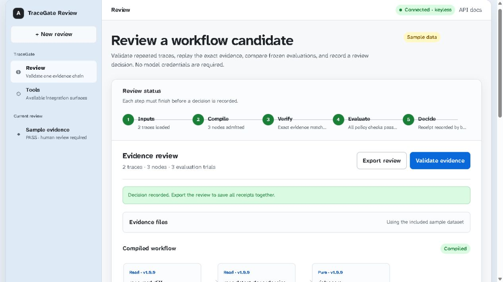
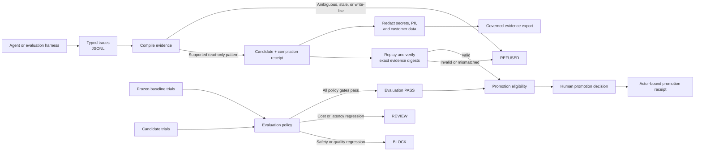
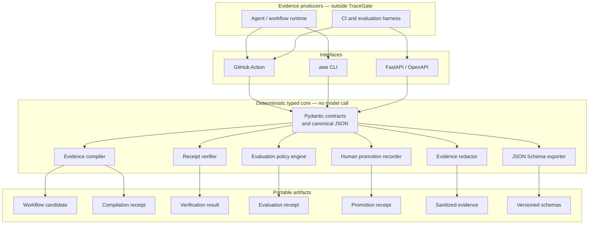

# AWE TraceGate

[](https://github.com/kingggg5/awe-tracegate/actions/workflows/ci.yml)
[](https://github.com/kingggg5/awe-tracegate/actions/workflows/codeql.yml)
[](LICENSE)
[](https://www.python.org/)

**Turn repeated agent traces into reviewable workflow candidates—with evidence
for every admitted dependency and no LLM key required by the verifier.**

> **Pre-alpha.** TraceGate compiles, verifies, evaluates, redacts, and records
> human review. It does not run agents, execute tools, or authorize production
> actions.



## Why TraceGate

Agent traces often look repeatable while hiding model decisions, ambiguous data
flow, stale evidence, or unsafe effects. Converting adjacency directly into an
executable workflow can preserve the wrong behavior and remove the human review
that made the original run safe.

TraceGate makes the narrow part deterministic: validate typed traces, prove
explicit bindings, refuse unsupported effects, compare frozen evaluations, and
emit content-addressed receipts that another machine can replay.

## What you get

- **Fail-closed compilation.** Only repeated `pure` and `read` traces with
  consistent evidence become a candidate; ambiguity becomes `refused`.
- **Offline verification.** Recompute candidate, receipt, input-bundle, and
  exact-trace replay digests without sending code or traces to a model.
- **Evaluation gates.** Safety violations and quality regressions block;
  latency or cost regressions require review.
- **Accountable promotion.** Human decisions bind actor, commit SHA, candidate,
  evaluation receipt, timestamp, and rationale—without executing the candidate.
- **Safer sharing.** A conservative JSON redactor removes common secret, PII,
  and customer-data patterns before evidence leaves its source.
- **Portable contracts.** Export versioned JSON Schema and use the same typed
  core through the CLI, FastAPI, or GitHub Action.

## Workflow

TraceGate sits between an agent harness and promotion. The harness may use any
model or runtime; TraceGate only consumes exported evidence and makes a
deterministic decision.



`PASS` means the supplied evidence satisfies the configured policy. It never
authorizes execution or proves that a workflow is safe in every environment.

## Architecture

The CLI, API, and GitHub Action are thin adapters over one typed deterministic
core. Every interface produces the same versioned contracts and decision
semantics.



The trust boundary is deliberate: agent execution, provider credentials, and
production side effects stay outside TraceGate. Inputs are validated before
entering the core; outputs are immutable, versioned JSON artifacts that can be
stored, reviewed, or replayed by another machine.

## Try it in five minutes

Requires Python 3.11 or newer.

```bash
git clone https://github.com/kingggg5/awe-tracegate.git
cd awe-tracegate
python -m venv .venv
```

Activate `.venv`, then install:

```bash
python -m pip install -e ".[api,dev]"
```

Compile the included synthetic repository-analysis traces:

```bash
awe compile \
  --traces examples/repo_analysis/traces.jsonl \
  --out receipt.json
```

Replay the receipt against the exact source evidence:

```bash
awe verify \
  --receipt receipt.json \
  --traces examples/repo_analysis/traces.jsonl
```

Expected verification:

```json
{
  "status": "valid",
  "traces_verified": true,
  "receipt_hash": "sha256:f4bab189f87c108abdd2ae12791391b24288056788865b099d017aaca0fe22ed",
  "reasons": []
}
```

The examples are synthetic and demonstrate contract behavior, not a production
performance claim.

## Gate a pull request

```yaml
name: AWE TraceGate
on: [pull_request]

permissions:
  contents: read

jobs:
  tracegate:
    runs-on: ubuntu-latest
    steps:
      - uses: actions/checkout@3d3c42e5aac5ba805825da76410c181273ba90b1
      - id: gate
        uses: kingggg5/awe-tracegate@v0.1.0
        with:
          traces: evidence/traces.jsonl
          baseline-evaluation: evidence/baseline.json
          candidate-evaluation: evidence/candidate.json
          evaluation-policy: evidence/policy.json
      - uses: actions/upload-artifact@b7c566a772e6b6bfb58ed0dc250532a479d7789f
        with:
          name: awe-receipt
          path: awe-compilation-receipt.json
```

For protected repositories, pin third-party actions to a reviewed full commit
SHA. The verifier itself needs no model-provider credential; generating new
agent trials may still use your existing harness or provider.

## CLI

| Command | Purpose | Success |
| --- | --- | --- |
| `awe compile` | Compile repeated read-only traces or refuse | compiled |
| `awe verify` | Recompute a receipt and optional source traces | valid |
| `awe evaluate` | Compare candidate and frozen baseline | pass |
| `awe redact` | Redact common sensitive JSON fields and values | completed |
| `awe promote` | Record an actor-bound human verdict | recorded |
| `awe schema` | Export versioned integration contracts | exported |

Exit code `0` means the requested gate passed, `2` means a valid refusal,
review, block, or invalid receipt, and `1` means malformed input or execution
error.

Evaluate the included frozen example:

```bash
awe evaluate \
  --baseline examples/evaluation/baseline.json \
  --candidate examples/evaluation/candidate.json \
  --policy examples/evaluation/policy.json
```

Export integration schemas:

```bash
awe schema --out-dir schemas
```

Run the optional local API:

```bash
uvicorn awe_tracegate.api:app --reload
```

Typed endpoints are available at `/v1/compile`, `/v1/verify`, and
`/v1/evaluate`; generated OpenAPI documentation is at `/docs`.

## Decision model

```text
typed traces -> evidence compiler -> compiled / refused
                                      |
frozen trials -> evaluation policy -> pass / review / block
                                      |
exact receipt -> offline verifier  -> valid / invalid
                                      |
human actor   -> promotion record  -> approved / rejected
```

`compiled` means the supplied evidence supports the emitted read-only
structure. It does not mean the workflow is semantically correct, causally
proven, authenticated, or safe to execute in production.

## Good fits

- Reviewing a prompt, skill, or harness change before promotion.
- Turning repeated read-only support or repository-analysis traces into a
  candidate for further evaluation.
- Producing a commit-attached evidence artifact for CI or an audit review.
- Rejecting stale, mismatched, ambiguous, or write-like evidence early.
- Preparing redacted, typed examples for a governed evaluation corpus.

TraceGate is not a replacement for LangGraph, Temporal, an observability
backend, or a sandbox. It integrates around runtimes instead of owning agent
execution.

## Security and project status

- SHA-256 receipts provide content integrity, not signer identity. Release
  artifacts use GitHub/Sigstore provenance; receipt signing is a later layer.
- The redactor covers explicit rules and common patterns; it is not a complete
  data-loss-prevention system. Review exported evidence before sharing it.
- The local API has no internet-facing authentication, tenancy, or rate-limit
  profile.
- Linear, identical trace shapes are supported today. Sparse branching is
  intentionally refused rather than guessed.

See the [security model](docs/security.md) and
[responsible disclosure policy](SECURITY.md) before integrating real evidence.

## Documentation

- [Architecture](docs/architecture.md)
- [Security model](docs/security.md)
- [Related work and differentiation](docs/related-work.md)
- [Roadmap](docs/roadmap.md)
- [Contributing](CONTRIBUTING.md)
- [Changelog](CHANGELOG.md)

## License

Apache-2.0. See [LICENSE](LICENSE).
