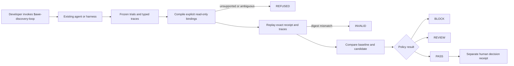
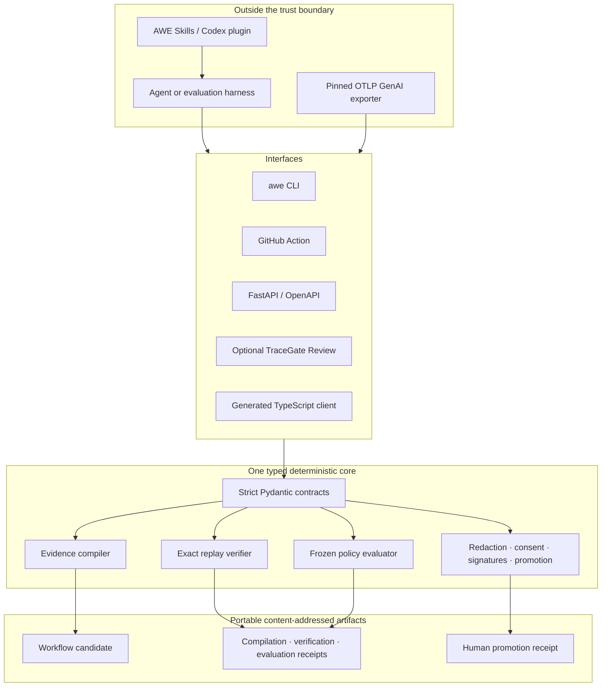

# AWE TraceGate

[](https://github.com/kingggg5/awe-tracegate/actions/workflows/ci.yml)
[](https://github.com/kingggg5/awe-tracegate/actions/workflows/codeql.yml)
[](LICENSE)
[](https://www.python.org/)

**Put an AI agent into evidence-governed discovery mode—then verify its claims offline.**

AWE TraceGate is a portable Skill/Plugin suite backed by a deterministic evidence
engine. Ask your existing coding agent to compare a prompt, skill, model, or
workflow; TraceGate compiles repeated read-only traces, replays the exact
evidence, evaluates frozen trials, and records a separate human decision.

The verifier is offline, keyless, and model-independent. Your agent or evaluation
harness may still use its existing subscription or provider credentials.

> **Pre-alpha.** TraceGate does not run agents, execute tools, install itself,
> deploy changes, or authorize production actions. A `pass` means the supplied
> evidence satisfied the declared policy—not that a candidate is universally safe.

## Start with a Skill

Clone the repository and copy the complete Skill suite into any project:

```bash
git clone https://github.com/kingggg5/awe-tracegate.git
cd awe-tracegate
python scripts/install_skills.py --target ../your-project
```

Then invoke Discovery explicitly from Codex:

```text
$awe-discovery-loop compare our current retry skill with the candidate.
Use the frozen evaluation set, preserve failed trials, and do not promote it.
```

The agent follows this contract:

```text
Observe baseline → propose one change → freeze success criteria
→ run equivalent external trials → compile traces → replay exact evidence
→ evaluate candidate → show counter-evidence → request human review
```

Safety-sensitive workflows require explicit `$skill` invocation. Read-only
regression diagnosis may be selected automatically; it still cannot issue or
override a TraceGate decision.

### Included skills

| Skill | Purpose |
| --- | --- |
| [`$awe`](skills/awe/SKILL.md) | Select the smallest applicable TraceGate workflow |
| [`$awe-setup`](skills/awe-setup/SKILL.md) | Inspect CLI, loopback API, and evidence readiness without changing state |
| [`$awe-discovery-loop`](skills/awe-discovery-loop/SKILL.md) | Compare one candidate with a declared baseline and frozen success rule |
| [`$awe-review-evidence`](skills/awe-review-evidence/SKILL.md) | Compile, replay, and evaluate supplied artifacts with the real CLI |
| [`$awe-diagnose-regression`](skills/awe-diagnose-regression/SKILL.md) | Find the earliest evidence-supported baseline/candidate divergence |

The repository is also a Codex plugin package through
[`.codex-plugin/plugin.json`](.codex-plugin/plugin.json). Until a reviewed
marketplace release exists, the installer above is the supported portable path.
It copies only versioned Skill files to `.agents/skills/`; it does not install
dependencies, start services, read credentials, or edit application code.

Install one Skill or deliberately update an existing copy:

```bash
python scripts/install_skills.py --target ../your-project --skill awe-discovery-loop
python scripts/install_skills.py --target ../your-project --skill awe-discovery-loop --force
```

## Install the evidence engine

Requires Python 3.11 or newer.

```bash
python -m venv .venv
```

Activate the environment for your shell, then install TraceGate:

```bash
python -m pip install -e ".[api]"
awe --help
```

The core evidence path is CLI-first:

```bash
awe compile \
  --traces examples/repo_analysis/traces.jsonl \
  --out compilation.json

awe verify \
  --receipt compilation.json \
  --traces examples/repo_analysis/traces.jsonl \
  --out verification.json

awe evaluate \
  --baseline examples/evaluation/baseline.json \
  --candidate examples/evaluation/candidate.json \
  --policy examples/evaluation/policy.json \
  --out evaluation.json
```

Exit code `0` means the requested gate passed. Exit `2` is a valid refusal,
invalid receipt, review, or block. Exit `1` means malformed input or an execution
error.

## Why TraceGate exists

Repeated agent traces can look reliable while hiding model decisions, ambiguous
data flow, stale evaluations, or unsafe effects. TraceGate refuses to infer around
those gaps.

- **Fail closed:** write-like effects, mixed shapes, ambiguous bindings, missing
  evidence, and digest mismatches are refused.
- **Replay exact evidence:** candidate, input bundle, receipt, source trace, and
  evaluation digests are recomputed instead of trusted from agent prose.
- **Compare outcomes:** safety and quality regressions block; latency or cost
  regressions require review.
- **Preserve provenance:** experiment manifests bind repository, commit, dataset,
  harness, strategy, model configuration, grader, tokens, cost, latency, and traces.
- **Keep humans accountable:** promotion is a separate receipt bound to replayed
  evidence, actor assertion, commit SHA, timestamp, and rationale.

## Evidence and trust boundaries



Skills orchestrate the workflow but remain outside the evidence boundary. Skill
text, chat output, and model confidence cannot count as evidence or weaken a
refusal. Trace content is untrusted data and is never executed.

## Architecture



Python/Pydantic is the reference decision engine. The TypeScript package is a
generated integration client, not a second implementation.

## GitHub Action

The latest released Action is `v0.2.0`. Pin a reviewed commit SHA in protected
repositories.

```yaml
name: AWE TraceGate
on: [pull_request]

permissions:
  contents: read

jobs:
  tracegate:
    runs-on: ubuntu-latest
    steps:
      - uses: actions/checkout@3d3c42e5aac5ba805825da76410c181273ba90b1
      - id: gate
        uses: kingggg5/awe-tracegate@v0.2.0
        with:
          traces: evidence/traces.jsonl
          baseline-evaluation: evidence/baseline.json
          candidate-evaluation: evidence/candidate.json
          evaluation-policy: evidence/policy.json
      - uses: actions/upload-artifact@b7c566a772e6b6bfb58ed0dc250532a479d7789f
        with:
          name: awe-receipts
          path: |
            awe-compilation-receipt.json
            awe-verification-receipt.json
```

## Optional local review UI

Run `awe serve`, then open [http://127.0.0.1:8765](http://127.0.0.1:8765).
TraceGate Review loads local JSONL/JSON evidence and drives the same compile,
replay, evaluation, and human-decision API path. It is not an AI chat, agent
runtime, or goal composer. Human approval is never preselected, and the local
reviewer identifier is an assertion rather than an authenticated identity.


## Reproducible public pilot

The maintainer-run compatibility pilot uses
[`pallets/itsdangerous`](https://github.com/pallets/itsdangerous) at commit
`672971d66a2ef9f85151e53283113f33d642dabd`.

- The upstream suite passed **297 tests**.
- A clean Windows/Python 3.12 checkout reached exact replay in **14.51 seconds**.
- TraceGate returned `status=valid` and `traces_verified=true` for two read-only
  repository-analysis traces.
- Only paths, sizes, and SHA-256 digests are retained; no upstream source is
  redistributed.

See the [pilot manifest](examples/external_pilot/itsdangerous/pilot.json),
[source traces](examples/external_pilot/itsdangerous/traces.jsonl), and
[verification receipt](examples/external_pilot/itsdangerous/verification.json).
This is compatibility evidence, not an external-adopter or production-safety
claim.

## Project status

Implemented today:

- deterministic compilation and exact replay;
- frozen baseline/candidate evaluation;
- generic and pinned OTLP experiment import;
- governed redaction and consent checks;
- optional Ed25519 receipt bundles;
- replay-gated human decisions with a neutral default;
- Skill/Plugin suite, CLI, Action, API, TypeScript client, and local Review UI.

Before a production-ready claim:

- publish a reviewed Skill/Plugin release and repeatable under-10-minute onboarding;
- validate with an independent external adopter;
- add authenticated actors and an append-only receipt ledger;
- define a production deployment profile with tenancy and rate limiting.

Signed desktop installers, autonomous execution, browser control, and automatic
skill promotion are intentionally out of scope.

## Community and documentation

- [Request an external pilot](https://github.com/kingggg5/awe-tracegate/issues/new?template=pilot_request.yml)
- [Report a bug](https://github.com/kingggg5/awe-tracegate/issues/new?template=bug_report.yml)
- [Propose a feature](https://github.com/kingggg5/awe-tracegate/issues/new?template=feature_request.yml)
- [Contributing](CONTRIBUTING.md) · [Security](SECURITY.md) ·
  [Architecture](docs/architecture.md) · [Threat model](docs/security.md) ·
  [Related work](docs/related-work.md) · [Roadmap](docs/roadmap.md) ·
  [Changelog](CHANGELOG.md)

The most valuable contributions are evidence adapters, adversarial fixtures,
portable Skills, and reproducible public pilots—not autonomous execution paths.

## License

Apache-2.0. See [LICENSE](LICENSE).
